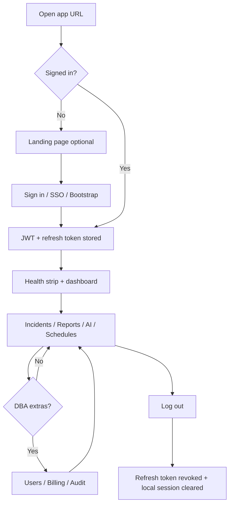

# DBOps Control Center — Operations Guide

This guide walks through **how the application works from first visit through sign-out**, for operators, DBAs, and buyers evaluating the product. It describes the live UI and API behavior, not deployment mechanics (see [README](../README.md) and [DEPLOYMENT.md](../DEPLOYMENT.md) for install and Railway setup).

**Live demo:** https://dbops-api-production-5047.up.railway.app  
**Roles:** `DBA`, `Analyst`, `Viewer` — every protected action is enforced on the API, not only in the browser.

---

## End-to-end flow (overview)

---

## 1. Arrival — opening the application

1. Open the **web URL** (for example `https://dbops-api-production-5047.up.railway.app`) in a full browser (Chrome, Edge, Firefox, or Safari). Do not rely on an email link preview pane; it often shows HTML without running JavaScript.
2. **First load** after a deploy can take a few seconds while the Railway service starts; refresh once if the page stays on “Loading…”.
3. If you see the **marketing landing page**, click **Sign In** or **Start Free Trial** to reach the operations console. The landing page is skipped once you are signed in (token stored in the browser).

The login screen shows a **system status** strip: API reachable and PostgreSQL reachable when healthy. If the API is misconfigured, the strip explains fixes (for example `VITE_API_URL` on the static site).

---

## 2. Authentication — getting in

### 2a. First-time setup (empty database only)

When **no users exist** in the database:

1. Scroll to **First-time setup (bootstrap DBA)** on the login panel.
2. Enter email, password (minimum 8 characters), and confirmation.
3. Submit — the first account is always created as **DBA**.
4. Sign in with those credentials on the form above.

After the first user exists, bootstrap is closed (`403` if attempted again). Additional accounts are created by a DBA (see section 6).

**Evaluation / demo hosts** often already have seed users (`barney@example.com`, etc. after `python -m app seed-demo`). Use credentials from your deployment guide; do not use bootstrap on a shared demo database.

### 2b. Email and password sign-in

1. Enter email and password.
2. Click **Login**.
3. On success the app stores:
   - **Access token** (JWT, short-lived, ~15 minutes) in memory and `localStorage` (`dbops_token`)
   - **Refresh token** (longer-lived) in `localStorage` (`dbops_refresh_token`)

Failed login shows API error text (wrong password, rate limit, disabled account). Too many attempts from one IP are rate-limited.

### 2c. SSO (optional)

If the deployment has OIDC configured (`OIDC_ISSUER`, `OIDC_CLIENT_ID`, etc.):

1. Click **Sign in with SSO**.
2. Complete the provider login (Google, Microsoft, or other OIDC).
3. The app exchanges the authorization code and issues the same JWT + refresh pair.

New SSO users receive a default role from `OIDC_DEFAULT_ROLE` (often `Viewer` until a DBA promotes them).

### 2d. Session while you work

- Before the access token expires, the app **automatically refreshes** using the refresh token (about every minute when near expiry).
- If refresh fails (revoked token, disabled user), you are signed out with a clear message.
- **Pause live / Resume live** controls whether the dashboard polls for updates on a timer.
- **Theme** toggles system / dark / light preference (stored locally).

---

## 3. Signed-in shell — what you always see

After login, the top bar shows:

| Element | Meaning |
|--------|---------|
| **Signed in as … (role)** | Current user from `GET /auth/me` |
| **Live updates on/off** | Auto-refresh of incidents, summary, schedules, etc. |
| **Theme** | UI appearance |
| **Log out** | End session (section 8) |

Below that, sections appear based on **role**:

| Section | DBA | Analyst | Viewer |
|---------|-----|---------|--------|
| Business Metrics + Stripe | Yes | No | No |
| Create user (DBA) | Yes | No | No |
| Summary, reports, AI, incidents | Yes | Yes | Yes |
| Create / edit incidents | Yes | Yes | No |
| Bulk acknowledge / assign / escalate | Yes | Yes | No |
| Resolve incidents | Yes | No | No |
| Report schedules + run audit | Yes | No | No |

---

## 4. Day-to-day operations (all roles that have access)

Work through the dashboard **accordion sections** in a typical order.

### 4.1 Operational summary

- Cards show **total / open / resolved / high-severity** incident counts from `GET /reports/summary` (SQL aggregates on the server).
- Use this as a quick health snapshot before diving into lists.

### 4.2 Run a whitelisted report

1. Open the **Reports** section.
2. Pick a report from the catalog (`GET /reports/catalog` — entries depend on role).
3. Fill any **parameters** (dates, limits, etc.).
4. Click **Run report** → `POST /reports/run` executes read-only SQL defined in code, not ad-hoc queries.
5. Review rows in the UI; optionally **Export CSV** (`POST /reports/export/csv`).
6. Each run is logged in the report audit trail (DBA can open **Report runs**).

Reports are **rate-limited per IP** to protect the database.

### 4.3 AI assist (optional)

Two helpers appear when configured:

| Helper | What it does |
|--------|----------------|
| **Natural language → report** | Maps your phrase to an existing catalog report key (never generates SQL). Uses OpenAI if `OPENAI_API_KEY` is set; otherwise heuristics. |
| **Incident handoff summary** | Three-line summary from incident + history for a chosen ID. |

Only reports your role may run are suggested.

### 4.4 Incidents — list, filter, and inspect

1. Open **Incidents**.
2. Use filters: status, severity, owner, search text, date range, **overdue** (open items past `due_at`).
3. Sort: newest, oldest, or severity.
4. For large lists, the API supports optional `?limit=` (1–500) and `?offset=`; the default UI loads all matches.

**Viewer:** read-only list, history, comments.  
**Analyst / DBA:** create and edit (see below).

### 4.5 Incidents — create and update (Analyst + DBA)

1. **Create incident:** title, description, severity, owner, optional due date → `POST /incidents`.
2. **Edit:** inline edit on a row → `PATCH /incidents/{id}` with field-level audit in history.
3. **History drawer:** timeline of created / updated / resolved / commented; add **comments**; download **History CSV**.
4. **Resolve (DBA only):** per-row resolve or bulk **resolve** in multi-select.

### 4.6 Bulk incident actions (Analyst + DBA)

1. Select open incidents (checkboxes).
2. Choose **acknowledge**, **assign**, **escalate**, or **resolve** (resolve = DBA only).
3. For **assign**, you must supply an owner (validated in the API).
4. Results show per-incident **updated** vs **skipped** with reasons (already resolved, owner unchanged, etc.).

---

## 5. DBA-only operations

### 5.1 User administration

In **Create user (DBA)**:

1. Create accounts with role **Viewer**, **Analyst**, or **DBA** (subject to plan user limits).
2. View the **accounts in database** table.
3. **Reset password**, **enable/disable**, or **delete** users (you cannot delete or disable yourself).
4. Review **user admin audit** entries (`GET /auth/users/audit`, capped at 500 rows).

Plan limits (`max_users`, `max_schedules`) come from billing settings; creating users beyond the limit returns `403`.

### 5.2 Scheduled reports

1. Define schedule: report key, cadence (daily/weekly UTC), time, delivery (`none`, **email** if SMTP configured, or **webhook**).
2. Enable/disable schedules; the background scheduler on the API processes due runs (one leader per tick on PostgreSQL).
3. Inspect **Report runs** for success/failure and row counts.

### 5.3 Business metrics and billing

**Business Metrics (DBA)** shows active users, incidents, schedules, plan usage, and billing scaffold.

Typical **first paying customer** flow on a dedicated deployment:

1. DBA signs in (bootstrap or seeded account).
2. **Subscribe with Stripe** → checkout session → customer pays on Stripe-hosted page.
3. Return URL `/?billing=success` — webhooks update `billing_status`, Stripe customer/subscription IDs, and plan limits.
4. Create the customer’s login via **Create user** (Stripe does not create app users).

Manual billing fields can be saved for testing; production should rely on webhooks. See [STRIPE_RAILWAY_SETUP.md](./STRIPE_RAILWAY_SETUP.md).

**Downgrade** (Pro/Enterprise → Starter) schedules change at the **next billing cycle** via `POST /billing/downgrade` with explicit confirmation.

### 5.4 Admin export (backup snapshot)

DBA can call `GET /admin/export` (UI may expose via API/docs) for a JSON snapshot of core tables — static queries per table, no dynamic SQL.

---

## 6. Background behavior you should know

| Process | Behavior |
|---------|----------|
| **Migrations** | Alembic runs when the API starts (`dbops-api`). |
| **Scheduler** | Polls for due report schedules; optional email/webhook delivery. |
| **Rate limits** | Auth endpoints and heavy API routes per client IP; `REDIS_URL` shares limits across replicas. |
| **Metrics** | `GET /metrics` requires `METRICS_BEARER_TOKEN` or DBA JWT — not public. |
| **CORS** | Browser calls allowed from configured origins (and named Railway hosts by default). |

---

## 7. Errors and forced exit

You may leave the session without clicking **Log out**:

| Situation | What happens |
|-----------|----------------|
| Access token expires and refresh fails | Local session cleared; return to login |
| API returns `401` on a protected call | Same — re-login message |
| Account disabled mid-session | `403` with disabled detail → forced logout |
| Browser tab closed | Tokens remain in `localStorage` until next visit or logout |

---

## 8. Final exit — signing out

1. Click **Log out** in the top bar.
2. The app sends `POST /auth/logout` with:
   - **Authorization:** `Bearer <access_token>`
   - **Body:** `{ "refresh_token": "<refresh>" }`
3. The server revokes **only that user’s** refresh token (must match the signed-in user).
4. The UI clears tokens from memory and `localStorage`, resets dashboard state, and returns to the **login** panel (landing page hidden until you sign out fully and clear state).

Access tokens already issued expire naturally within ~15 minutes; logout stops renewal via refresh.

**Best practice for shared machines:** always use **Log out**; do not rely on closing the tab alone.

---

## 9. Role quick reference

| Task | Viewer | Analyst | DBA |
|------|:------:|:-------:|:---:|
| View incidents, summary, reports (run/export) | ✓ | ✓ | ✓ |
| Comment on incidents | ✓ | ✓ | ✓ |
| Create / edit incidents | | ✓ | ✓ |
| Bulk ack / assign / escalate | | ✓ | ✓ |
| Resolve incidents | | | ✓ |
| Manage users | | | ✓ |
| Report schedules + run audit | | | ✓ |
| Stripe subscribe / billing admin | | | ✓ |

Full API matrix: [README — RBAC matrix](../README.md#rbac-matrix).

---

## 10. Demo vs production

| Topic | Shared demo (e.g. Railway) | Buyer production |
|-------|---------------------------|------------------|
| Bootstrap | Usually disabled (seed users exist) | Use on empty DB once |
| Credentials | Published evaluation passwords | Unique passwords per org |
| Billing | Test or live Stripe per env | Live keys + webhooks |
| Data | Sample incidents/reports | Real data; optional `reset-demo` between workshops |

---

## Related documentation

| Document | Use when |
|----------|----------|
| [USER_WALKTHROUGH.md](./USER_WALKTHROUGH.md) | **Training:** step-by-step exercises (Viewer → Analyst → DBA) |
| [README.md](../README.md) | Install, env vars, RBAC API table, testing |
| [DEPLOYMENT.md](../DEPLOYMENT.md) | Railway deploy and env configuration |
| [STRIPE_RAILWAY_SETUP.md](./STRIPE_RAILWAY_SETUP.md) | Checkout and webhooks |
| [LIVE_DEMO_RAILWAY_CHECKLIST.md](./commercial-assets/LIVE_DEMO_RAILWAY_CHECKLIST.md) | Sharing the public demo URL |
| [onboarding-checklist-day0-day7.md](./commercial-assets/onboarding-checklist-day0-day7.md) | Week-one rollout for new buyers |
| [DEMO_VIDEO_5-8MIN.md](./commercial-assets/DEMO_VIDEO_5-8MIN.md) | Recorded walkthrough script |
| [OPERATIONAL_READINESS.md](./OPERATIONAL_READINESS.md) | Production hardening and scale notes |

---

*DBOps Control Center — operator guide. For licensing, see [DBOps_LICENSE.md](../DBOps_LICENSE.md).*
